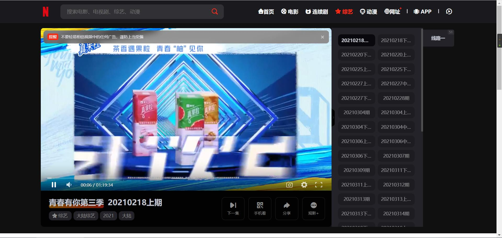

# JlenVideo

`JlenVideo` 是一个基于原生 Android + Jetpack Compose 开发的苹果 CMS 影视客户端，目标不是简单套壳网页，而是在保留苹果 CMS 站点能力的前提下，提供更接近原生 App 的浏览、搜索、详情、播放和账号体验。

当前默认适配站点：

- `https://cms.jlen.top/`

当前正式版：

- `versionName`: `2.0.1.1`
- `versionCode`: `15`

版本配置位置：

- [app/build.gradle.kts](app/build.gradle.kts)

仓库地址：

- GitHub: [https://github.com/jinnian0703/JlenVideo](https://github.com/jinnian0703/JlenVideo)

## 目录

- [项目特点](#项目特点)
- [适配说明](#适配说明)
- [数据来源](#数据来源)
- [模板文件](#模板文件)
- [模板预览](#模板预览)
- [主要功能](#主要功能)
- [技术栈](#技术栈)
- [核心目录](#核心目录)
- [如何修改站点 API](#如何修改站点-api)
- [苹果 CMS 路由规则](#苹果-cms-路由规则)
- [编译教程](#编译教程)
- [1. 克隆项目](#1-克隆项目)
- [2. 使用 Android Studio 打开](#2-使用-android-studio-打开)
- [3. 编译调试包](#3-编译调试包)
- [4. 编译正式包](#4-编译正式包)
- [检查更新说明](#检查更新说明)
- [发布建议](#发布建议)
- [2.0.1.1 版本说明](#2011-版本说明)
- [License](#license)

## 项目特点

- 原生首页、片库、详情、搜索、播放、账号页，不直接套用网页界面
- 支持苹果 CMS JSON 接口和 HTML 页面双通道解析
- 首页推荐位可直接读取苹果 CMS 推荐数据
- 原生播放器接管网页播放，支持全屏、倍速、暂停、下一集和自动连播
- 支持登录、注册、找回密码、邮箱绑定、资料修改、收藏、历史、会员信息
- 支持热搜榜、搜索记录和独立搜索结果页
- 支持崩溃日志记录与 GitHub Release 检查更新

## 适配说明

这个客户端是围绕苹果 CMS 站点能力做的原生封装，整体适配思路如下：

- 能走 JSON 接口的页面优先走接口，保证速度和稳定性
- 接口没有覆盖的功能，通过 HTML 页面解析补齐
- 播放页解析出真实播放地址后，交给原生播放器继续处理

目前已接入或适配的内容包括：

- 首页推荐
- 最近更新
- 片库分类与分页
- 搜索与热搜
- 影视详情
- 线路与选集
- 原生接管播放
- 用户中心相关功能

## 数据来源

当前版本的数据读取逻辑大致如下：

- 首页推荐：读取站点推荐位 `level=1`
- 最近更新：解析 `https://cms.jlen.top/label/new/`
- 片库列表：使用 `api.php/provide/vod/?ac=list&pg=页码`
- 搜索、详情、用户中心、收藏、历史、会员等：以页面解析为主
- 更新检测：读取 GitHub Release 最新发布

首页推荐说明：

- 首页顶部推荐区只读取苹果 CMS 推荐位 `level=1`
- 当前版本不再使用 `level=8` 热播位和 `level=9` 轮播位
- 如果后台已经设置了推荐位但前端仍为空，请优先确认对应影片是否确实设置为 `level=1`

## 模板文件

仓库内已附带当前适配时参考使用的模板文件：

- [templates/v2.zip](templates/v2.zip)
- [templates/DYXS2](templates/DYXS2)

推荐使用方式：

- 如果你准备复刻 `cms.jlen.top` 这一套站点结构，优先使用 [templates/v2.zip](templates/v2.zip)
- 如果你需要查看模板解压后的目录、页面和静态资源，可以直接参考 [templates/DYXS2](templates/DYXS2)
- 如果你更换成别的苹果 CMS 模板，客户端仍可继续适配，但搜索、详情、播放、用户中心等 HTML 解析规则通常需要一起调整

## 模板预览

以下截图来自附带模板 `DYXS2`：




## 主要功能

- 首页推荐、最近更新、片库浏览
- 搜索页重构，支持搜索记录、热搜榜和独立结果页
- 热搜榜聚合腾讯视频、爱奇艺、优酷、芒果 TV 等平台公开数据
- 影视详情页、线路切换、选集切换
- 原生播放器接管播放
- 播放器支持全屏、倍速、暂停、继续播放、下一集、自动播放下一集
- 自动记录观看历史
- 收藏、历史、会员基础信息展示
- 登录、注册、找回密码、资料修改、邮箱绑定和解绑
- 关于页、版本信息、更新检查、崩溃日志

## 技术栈

- Kotlin
- Jetpack Compose
- Navigation Compose
- ViewModel
- OkHttp
- Retrofit
- Gson
- Jsoup
- Coil
- Media3 ExoPlayer

## 核心目录

主要代码位置如下：

- [app/src/main/java/top/jlen/vod/MainActivity.kt](app/src/main/java/top/jlen/vod/MainActivity.kt)
- [app/src/main/java/top/jlen/vod/JlenVideoApplication.kt](app/src/main/java/top/jlen/vod/JlenVideoApplication.kt)
- [app/src/main/java/top/jlen/vod/CrashLogger.kt](app/src/main/java/top/jlen/vod/CrashLogger.kt)
- [app/src/main/java/top/jlen/vod/data/AppleCmsApi.kt](app/src/main/java/top/jlen/vod/data/AppleCmsApi.kt)
- [app/src/main/java/top/jlen/vod/data/AppleCmsRepository.kt](app/src/main/java/top/jlen/vod/data/AppleCmsRepository.kt)
- [app/src/main/java/top/jlen/vod/data/Models.kt](app/src/main/java/top/jlen/vod/data/Models.kt)
- [app/src/main/java/top/jlen/vod/data/PersistentCookieJar.kt](app/src/main/java/top/jlen/vod/data/PersistentCookieJar.kt)
- [app/src/main/java/top/jlen/vod/data/SearchHistoryStore.kt](app/src/main/java/top/jlen/vod/data/SearchHistoryStore.kt)
- [app/src/main/java/top/jlen/vod/ui/AppViewModel.kt](app/src/main/java/top/jlen/vod/ui/AppViewModel.kt)
- [app/src/main/java/top/jlen/vod/ui/JlenVideoApp.kt](app/src/main/java/top/jlen/vod/ui/JlenVideoApp.kt)
- [app/src/main/java/top/jlen/vod/ui/BrowseScreens.kt](app/src/main/java/top/jlen/vod/ui/BrowseScreens.kt)
- [app/src/main/java/top/jlen/vod/ui/DetailPlayerScreens.kt](app/src/main/java/top/jlen/vod/ui/DetailPlayerScreens.kt)
- [app/src/main/java/top/jlen/vod/ui/NativeVideoPlayer.kt](app/src/main/java/top/jlen/vod/ui/NativeVideoPlayer.kt)
- [app/src/main/java/top/jlen/vod/ui/FullscreenPlayerActivity.kt](app/src/main/java/top/jlen/vod/ui/FullscreenPlayerActivity.kt)

## 如何修改站点 API

当前站点基础地址配置在：

- [app/build.gradle.kts](app/build.gradle.kts)

找到这一行：

```kotlin
buildConfigField("String", "APPLE_CMS_BASE_URL", "\"https://cms.jlen.top/\"")
```

替换成你自己的苹果 CMS 站点，例如：

```kotlin
buildConfigField("String", "APPLE_CMS_BASE_URL", "\"https://your-domain.com/\"")
```

修改时建议注意这些点：

- 必须带协议头，例如 `https://`
- 末尾建议保留 `/`
- 如果站点开启了 Cloudflare、人机验证或额外反爬，部分功能可能需要补充适配
- 如果你更换了模板，HTML 解析逻辑通常也要一起改

## 苹果 CMS 路由规则

如果你的站点同样基于这套模板，建议在苹果 CMS 后台开启以下选项：

- 隐藏后缀：开启
- 路由状态：开启
- 伪静态状态：开启

建议使用下面这组路由伪静态规则：

```text
map   => map/index
rss/index   => rss/index
rss/baidu => rss/baidu
rss/google => rss/google
rss/sogou => rss/sogou
rss/so => rss/so
rss/bing => rss/bing
rss/sm => rss/sm

index-<page?>   => index/index

gbook-<page?>   => gbook/index
gbook$   => gbook/index

topic-<page?>   => topic/index
topic$  => topic/index
topicdetail-<id>   => topic/detail

actor-<page?>   => actor/index
actor$ => actor/index
actordetail-<id>   => actor/detail
actorshow/<area?>-<blood?>-<by?>-<letter?>-<level?>-<order?>-<page?>-<sex?>-<starsign?>   => actor/show

role-<page?>   => role/index
role$ => role/index
roledetail-<id>   => role/detail
roleshow/<by?>-<letter?>-<level?>-<order?>-<page?>-<rid?>   => role/show

vodtype/<id>-<page?>   => vod/type
vodtype/<id>   => vod/type
voddetail/<id>   => vod/detail
vodrss-<id>   => vod/rss
vodplay/<id>-<sid>-<nid>   => vod/play
voddown/<id>-<sid>-<nid>   => vod/down
vodshow/<id>-<area?>-<by?>-<class?>-<lang?>-<letter?>-<level?>-<order?>-<page?>-<state?>-<tag?>-<year?>   => vod/show
vodsearch/<wd?>-<actor?>-<area?>-<by?>-<class?>-<director?>-<lang?>-<letter?>-<level?>-<order?>-<page?>-<state?>-<tag?>-<year?>   => vod/search
vodplot/<id>-<page?>   => vod/plot
vodplot/<id>   => vod/plot

arttype/<id>-<page?>   => art/type
arttype/<id>   => art/type
artshow-<id>   => art/show
artdetail-<id>-<page?>   => art/detail
artdetail-<id>   => art/detail
artrss-<id>-<page>   => art/rss
artshow/<id>-<by?>-<class?>-<level?>-<letter?>-<order?>-<page?>-<tag?>   => art/show
artsearch/<wd?>-<by?>-<class?>-<level?>-<letter?>-<order?>-<page?>-<tag?>   => art/search

label-<file> => label/index

plotdetail/<id>-<page?>   => plot/plot
plotdetail/<id>   => plot/detail
```

## 编译教程

### 1. 克隆项目

```bash
git clone https://github.com/jinnian0703/JlenVideo.git
cd JlenVideo
```

### 2. 使用 Android Studio 打开

- 打开 Android Studio
- 选择项目根目录
- 等待 Gradle 同步完成

### 3. 编译调试包

Windows：

```powershell
.\gradlew.bat assembleDebug
```

macOS / Linux：

```bash
./gradlew assembleDebug
```

输出位置：

- `app/build/outputs/apk/debug/app-debug.apk`

### 4. 编译正式包

配置签名后执行：

```powershell
.\gradlew.bat assembleRelease
```

输出位置：

- `app/build/outputs/apk/release/app-release.apk`

## 检查更新说明

当前版本的更新检测基于 GitHub Release：

- 接口读取 `releases/latest`
- 版本号取自 `tag_name`
- 更新说明取自 `body`
- “查看发布”跳转到 Release 页面
- “前往下载”优先读取 APK 资产下载地址

如果你想切换成自己的仓库更新逻辑，建议按下面修改：

1. 修改 [app/src/main/java/top/jlen/vod/data/AppleCmsRepository.kt](app/src/main/java/top/jlen/vod/data/AppleCmsRepository.kt) 中的 GitHub Release 接口地址
2. 修改同文件中的 Release 页面兜底地址
3. 修改 [app/build.gradle.kts](app/build.gradle.kts) 里的 `versionCode` 和 `versionName`
4. 创建新的 tag，例如 `v2.0.1.1`
5. 创建 GitHub Release 并上传 APK

注意事项：

- `versionName` 建议与 Release 标签对应，例如本地 `2.0.1.1` 对应 `v2.0.1.1`
- 如果没有上传 APK 资产，下载按钮会自动回退到 Release 页面
- 如果最新版本仍是 Draft，GitHub 的最新发布接口通常不会返回

## 发布建议

后续建议按以下流程发布版本：

1. 修改代码并完成自测
2. 执行调试包或正式包构建
3. 更新 README、更新日志或 Release 说明
4. 提交代码并推送
5. 打 tag
6. 创建 GitHub Release
7. 上传 APK

## 2.0.1.1 版本说明

当前仓库版本现已提升为 `2.0.1.1`。

`2.0.1.1` 在 `2.0.1` 基础上继续优化了搜索结果页的空状态提示，移除了多余返回按钮，并统一了搜索无结果时的引导文案。

最近一个已整理记录的大版本功能更新为 `2.0.0`，相关能力已合入当前版本。

- 重建搜索页结构，分离搜索入口、搜索记录、热搜榜和结果页
- 新增多平台热搜榜抓取能力
- 已接入腾讯视频、爱奇艺、优酷、芒果 TV 热搜内容
- 修复爱奇艺第 `10` 条显示异常的问题
- 修复优酷热搜数据解析失败导致不显示的问题

## License

本项目采用 MIT License，详见：

- [LICENSE](LICENSE)
